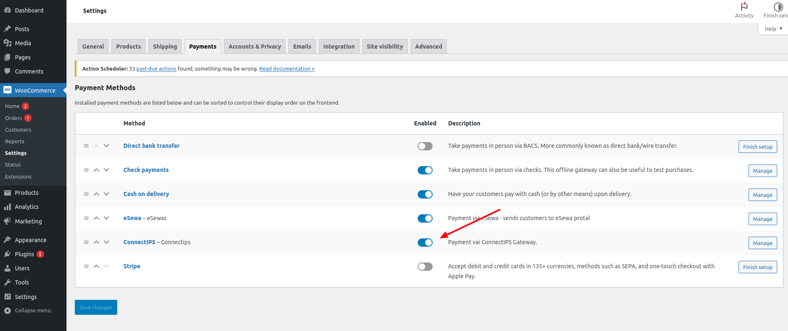
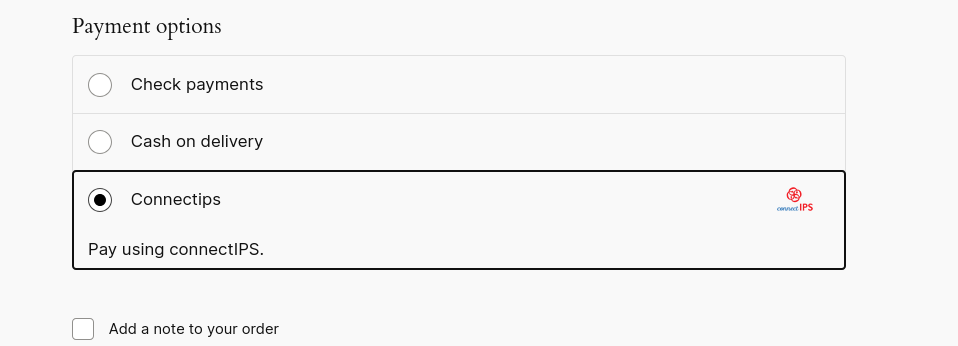
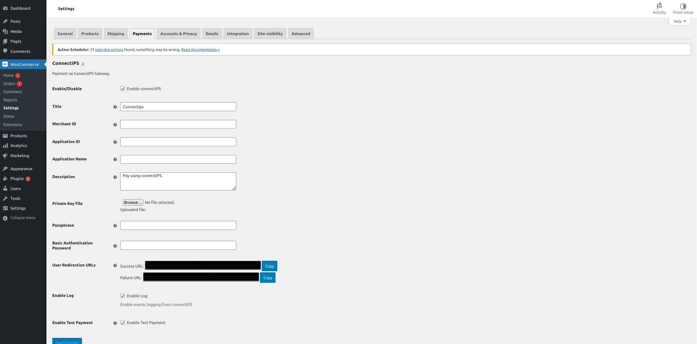

# Getting Started

## General Setup
Once activated, go to WooCommerce > Settings > Payments and enable the ConnectIPS payment gateway.

Once enabled, you will be able to see the ConnectIPS payment gateway in the list of payment methods.

## Configure ConnectIPS

To configure the ConnectIPS payment gateway, go to WooCommerce > Settings > Payments > ConnectIPS and fill in the required fields.

### Enable/Disable
Enable or disable the ConnectIPS payment gateway.

### Title
The title of the ConnectIPS payment gateway.

### Merchant ID
Merchant ID is and unique identifier to identify merchant in the system. Merchant ID will be provided by NCHL upon registering merchant for connectIPS Core Module on banks’ request

### Application ID
Unique identification, which will be used to identify the accountdetails of the merchant’s application. A merchant can have multiple applications based on different banks account used for various shopping sites. Application Id will be provided by NCHL after registration.

### Application Name
Application name to identify merchant as well as originating application.

### Description
Text to be shown during checkout.

### Private Key File
Digital certificate private key (pfx file/keystore)

### Passphrase
Passphrase to decrypt the digital certificate private key (pfx file/keystore).

### Basic Authentication Password
Basic authentication password provided in email for transaction validation. 

### User Redirection URLs
Before performing transactions, a static pair of successURL and failureURL has to be provided to the connectIPS integration support team. connectIPS itself handles user redirection and sends the user to whichever URL provided for testing after entering the OTP. Please provide full URL to the connectIPS integration support team. 

### Enable Log
Enable events logging from connectIPS 

### Enable Test Payment
Enable test payments from connectIPS on test URL instead of live URL.